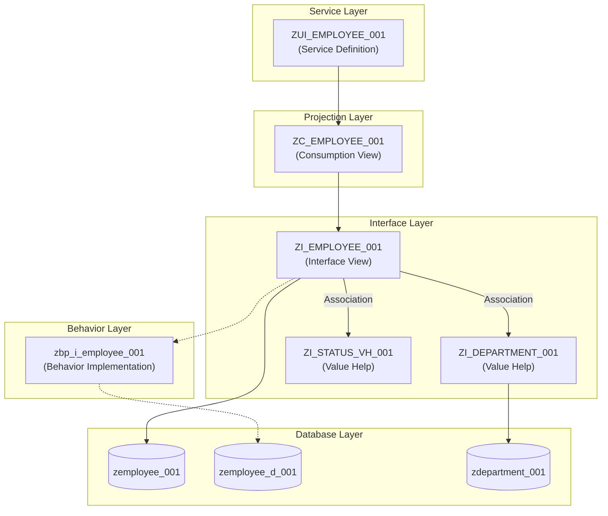

# zlocal-btp-learning
abapGit導入実践編

## コンテンツ

### Employee管理 (実践編)
ABAP RESTful Application Programming Model (RAP) の基礎を学ぶための実践的なサンプルコードです。
従業員情報の参照・登録・更新・削除 (CRUD) アプリケーションを以下の構成で実装しています。

#### アーキテクチャ構成図

#### オブジェクト詳細解説

各レイヤーの役割と実装のポイントは以下の通りです。

#### 1. Database Layer (永続化層)
データの物理的な保存場所です。

*   **`zemployee_001` (Master Table)**:
    *   従業員の実際のデータを格納するテーブルです。
    *   フィールド名はスネークケース (`emp_id`, `first_name` 等) で定義されています。
*   **`zemployee_d_001` (Draft Table)**:
    *   RAPのドラフト機能（下書き保存）を実現するための一時テーブルです。
    *   ユーザーが「保存」ボタンを押す前の入力途中のデータがここに保持されます。

#### 2. Interface Layer (Core)
データモデルの中核となる層です。DBとのマッピングやデータ同士の関連を定義します。

*   **`ZI_EMPLOYEE_001` (Interface View)**:
    *   DBテーブル `zemployee_001` との直接的なマッピングを行います。
    *   **命名規則の変換**: DBのスネークケースを、ABAP/CDS標準のキャメルケース (`EmployeeId`, `FirstName` 等) に変換（エイリアス定義）しています。
    *   **関連 (Association)**: 部署 (`ZI_DEPARTMENT_001`) やステータス (`ZI_STATUS_VH_001`) とのリレーションを定義し、データアクセスを容易にしています。
*   **`ZI_STATUS_VH_001` (Value Help)**:
    *   ステータスの選択肢（A:在職中, B:休職中, C:退職）を提供するビューです。
    *   固定値として実装されており、DBアクセスを行わずに選択リストを提供します。
*   **`ZI_DEPARTMENT_001` (Value Help)**:
    *   部署の選択肢を提供するビューです。
    *   部署テーブル (`zdepartment_001`) を参照しています。

#### 3. Behavior Layer (振る舞い)
ビジネスロジックを実装する層です。`ZI_EMPLOYEE_001` に対して定義されています。

*   **`zbp_i_employee_001` (Behavior Implementation Class)**:
    *   データの作成・更新・削除時のロジックをABAPコードで記述しています。
    *   **Determination (自動設定)**:
        *   `initStatus`: 新規作成時にステータスの初期値を「A (在職中)」に自動設定します。
    *   **Validation (入力チェック)**:
        *   `validateStatus`: ステータスが不正な値でないかチェックします。
        *   `validateSalary`: 給与がマイナスでないかチェックします。
        *   `validateJoinDate`: 入社日が未入力でないかチェックします。

#### 4. Projection/Consumption Layer (UI/API)
特定のユースケース（今回はFiori Elementsによる管理画面）向けにデータを投影する層です。

*   **`ZC_EMPLOYEE_001` (Consumption View)**:
    *   `ZI_EMPLOYEE_001` をベースに、画面表示に必要な設定を追加しています。
    *   **UI Annotation**: どの項目を一覧表示するか、検索条件にするか、ラベル名をどうするか等を定義しています。
    *   **Value Help割り当て**: ステータスや部署IDの入力フィールドに、ドロップダウンリスト（Value Help）を割り当てています。

#### 5. Service Layer (公開)
外部（Fiori UI や 他システム）からアクセスするためのエンドポイント定義です。

*   **`ZUI_EMPLOYEE_001` (Service Definition)**:
    *   `ZC_EMPLOYEE_001` を `Employee` というエンティティ名でODataサービスとして公開します。
    *   ブラウザやPostmanからこのサービス経由でデータにアクセスします。
